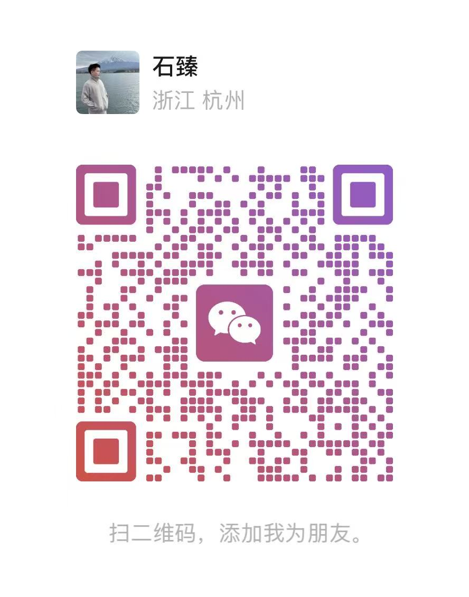
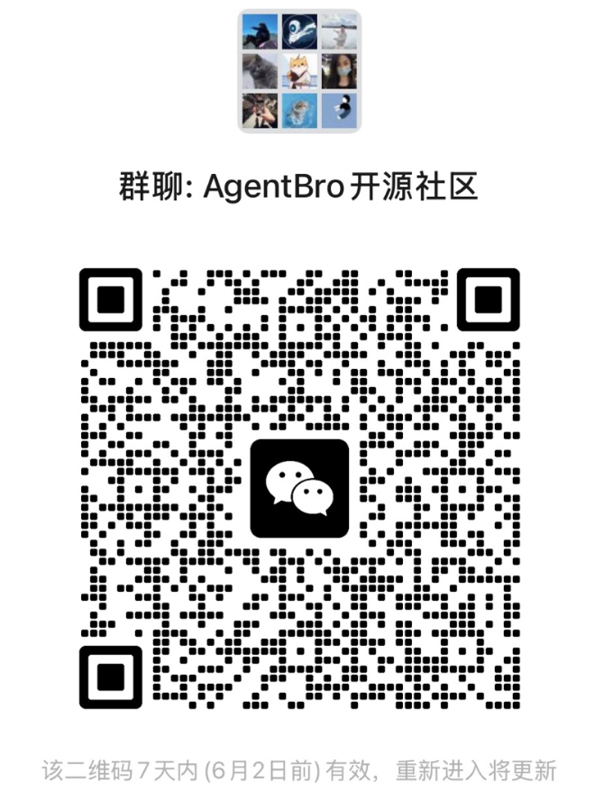

<div align="center">
  

  <h1>AgentBro</h1>

  <p><strong>Make Agents Easier to Use</strong></p>

  <p>
    A native macOS Dynamic Island for AI coding agents.<br />
    Bring permissions, questions, plans, quick replies, remote sessions, tool activity, and completions into one lightweight desktop island.
  </p>

  <p>
    <a href="https://www.agentbro.net">Website</a>
    ·
    <a href="https://github.com/shirenchuang/agentbro/releases">Download</a>
    ·
    <a href="docs/privacy-policy.md">Privacy</a>
    ·
    <a href="README.md">中文</a>
  </p>

  <p>
    
    
    
  </p>
</div>

## What Is AgentBro?

AgentBro is a native macOS app that floats above your editor and terminal. It watches active sessions from AI coding agents such as Claude Code, Codex, and Gemini CLI, then collects the flow-breaking moments into a small Dynamic Island. You can approve permissions, answer questions, send quick replies, and forward agent events from remote SSH machines back to your local desktop.

The first open-source release focuses on the **Dynamic Island module**. Larger modules such as Agent Monitor, Agent Switch, and Skills management are not exposed in the public app menu yet. Future modules will evolve gradually based on real usage and community feedback.

## Logo Meaning

The center of the AgentBro logo is shaped like a handshake. It represents the collaboration between humans and AI agents: not replacement, not remote control, but a bro-like companion that helps, nudges, and catches the moments that need attention. The outer `A` / `B` structure comes from the AgentBro initials and also resembles two connected agent nodes.

## Demo Videos

### Interaction Demo

https://github.com/user-attachments/assets/df857822-ea0a-4745-a0b9-80f265f30dc6

### Theme Demo

https://github.com/user-attachments/assets/374d6e53-c126-41be-a593-4e5f63485602

## Supported Themes

| Theme | ID | Style |
| --- | --- | --- |
| Midnight | `midnight` | Default dark theme for long coding sessions and low-light environments. |
| AgentBro Classic | `ink-amber` | Warm brand theme with ink and amber contrast. |
| Frosted Glass | `frosted-glass` | Light glass-style theme for bright desktops. |
| Apple | `apple` | Clean macOS-style theme with a native, low-distraction feel. |
| Smoke | `smoke` | Neutral light theme for calmer continuous monitoring. |
| Ocean Mist | `ocean-mist` | Cool light theme with blue accents for state and actions. |
| Warm Paper | `warm-paper` | Warm paper-like theme for softer desktop setups. |
| Soft Lavender | `soft-lavender` | Gentle lavender theme with a lighter, lower-contrast feel. |
| System | `system` | Follows the system light / dark appearance automatically. |

## Main Features

| Feature | Description |
| --- | --- |
| Dynamic Island | Compact, hover, expanded, and detail views for active agent sessions. |
| Instant actions | Handle permission requests, questions, plan approvals, completions, and response cards in the island. |
| Quick replies | Type a message directly in the island without switching back to the terminal. |
| Task awareness | Show tool activity, subagent progress, task summaries, and token/rate-limit data where supported. |
| Pet mode | Switch the island into a pet status panel whose vitals react to context pressure and token usage. |
| Pet Market | Browse community pets and install them with one click, powered by the abpets CLI. See [www.agentbro.net/pets](https://www.agentbro.net/pets). |
| Hook integration | One-click hook installation, Hook Doctor diagnostics, and custom CLI hook templates. |
| Desktop controls | Global shortcuts, sounds, notifications, themes, display placement, and terminal-focus suppression. |
| Local-first | The hook server runs locally through `/tmp/agentbro.sock` or `127.0.0.1:17892`. |
| SSH Remote | Forward agent events from remote SSH machines back to your local island for remote development. |
| Webhook notifications | Send notifications to DingTalk / Feishu webhooks. |

## Pet Market

Beyond the island, AgentBro can switch the floating window into a **pet status panel**: a desktop pet follows your active agent, and its vitals react in real time to context pressure and token usage — so you can tell at a glance whether a session is relaxed or under strain.

The **Pet Market** lets you browse community-contributed pets and install them with one click, all driven by the [`abpets`](https://www.npmjs.com/package/abpets) CLI (Node.js v18+). Open it from **Island -> Pet Market** in settings, or preview every pet on the web:

👉 **[www.agentbro.net/pets](https://www.agentbro.net/pets)**


## Supported Agents

AgentBro includes adapters and hook management for:

| Agent | Status |
| --- | --- |
| Claude Code | Full integration |
| Codex | Full integration |
| Gemini CLI | Full integration |
| Cursor / Cursor CLI | Full integration |
| GitHub Copilot | Full integration |
| Trae / Trae CN | Full integration |
| Qoder / Qoder CLI | Supported |
| CodeBuddy / CodeBuddy CN | Supported |
| Qwen | Supported |
| Kimi | Supported |
| OpenCode | Supported |
| Droid | Supported |
| Factory | Supported |
| StepFun | Supported |
| AntiGravity | Supported |
| WorkBuddy | Supported |
| Hermes | Supported |
| Pi | Supported |
| Kiro | Supported |

## Roadmap

AgentBro stays local-first. The first public release focuses on making the island, hook integration, quick actions, and SSH Remote reliable. Future directions we want to explore include:

- Remote sync: sync settings, hooks, themes, prompts, skills, and remote host configuration across devices.
- Skills community: discover, install, share, and update Skill Packs for different agents.
- Pet ecosystem: ship more community pets, grow the Pet Market, and open up authoring and sharing of custom pets.
- Team collaboration: shared configuration, team Skill Packs, access control, and clearer collaboration views.

## Join The Community

If you use AgentBro or want to discuss upcoming Windows support, Agent Monitor, Agent Switch, or Skills management, scan the QR code to add the maintainer on WeChat (mention **AgentBro community**), or join the **AgentBro Open Source Community** group chat directly.

<div align="center">
  <table>
    <tr>
      <td align="center">
        <br />
        <sub>Add on WeChat — mention <b>AgentBro community</b></sub>
      </td>
      <td align="center">
        <br />
        <sub>Group chat: <b>AgentBro Open Source Community</b> (QR refreshed every 7 days)</sub>
      </td>
    </tr>
  </table>
</div>

## Platform Support

AgentBro is currently developed, tested, and released for **macOS** first.

Windows support is planned. The Tauri + React + Rust foundation is portable, but a good Windows release still needs dedicated work for floating window behavior, tray integration, shortcuts, terminal/editor focus detection, hook paths, installers, signing, and release automation.

Linux support is possible later, but it is not part of the first public release target.

## Installation

### Homebrew Cask

One-line install:

```bash
brew tap shirenchuang/tap && brew install --cask agentbro
```

Step-by-step install:

```bash
brew tap shirenchuang/tap
brew install --cask agentbro
```

### Download a Release

- 🌍 [GitHub Releases](https://github.com/shirenchuang/agentbro/releases) (all versions)
- 🇨🇳 Mainland China mirror (faster): [latest DMG](https://agenbro.oss-cn-hangzhou.aliyuncs.com/AgentBro_latest_universal.dmg)

## Local Development

### Prerequisites

- macOS
- Node.js
- pnpm
- Rust toolchain + Cargo
- Tauri CLI: `cargo tauri --version`

### Start The Project

```bash
git clone https://github.com/shirenchuang/agentbro.git
cd agentbro
pnpm install
pnpm tauri:dev
```

`pnpm tauri:dev` starts the Vite dev server on `http://localhost:1423` and opens the native AgentBro windows.

### Browser-Only UI Development

```bash
pnpm dev
```

Open:

- Island UI: `http://localhost:1423`
- Settings UI: `http://localhost:1423/#settings`

The browser development view includes the Claude Hook UI Lab for testing static island states such as permission requests, plan approval, questions, completion, compact mode, list mode, and detail mode.

### Common Commands

```bash
pnpm test:run      # Run tests once
pnpm test          # Run tests in watch mode
pnpm lint          # ESLint
pnpm build         # Type-check and build frontend
cargo check        # Check Rust backend
pnpm tauri:build   # Build the Tauri app
./build.sh         # Build universal macOS DMG
```

## Use With An Agent

1. Open AgentBro settings.
2. Go to **Island -> Integration**.
3. Run **Hook Doctor**.
4. Click **Install All Hooks**, or install the hook for the agent you use.
5. Restart the corresponding CLI session.
6. Start Claude Code, Codex, Gemini CLI, or another supported agent.

AgentBro will then show session state, tool activity, approvals, questions, plans, and completions in the island.

## Contributing

Issues and pull requests are welcome!

- Contributing guide: [CONTRIBUTING.en.md](CONTRIBUTING.en.md)
- Code of conduct: [CODE_OF_CONDUCT.md](CODE_OF_CONDUCT.md)
- AI agent collaboration guide: [AGENTS.md](AGENTS.md)
- Claude Code project config: [.claude/CLAUDE.md](.claude/CLAUDE.md)

Please target the `dev` branch. Run `pnpm lint && pnpm test:run && pnpm build && cargo check --manifest-path src-tauri/Cargo.toml` before submitting.

## Release

Release notes and signing requirements live in [`docs/release.md`](docs/release.md).

- Website: [www.agentbro.net](https://www.agentbro.net)
- China mirror: `https://agenbro.oss-cn-hangzhou.aliyuncs.com/AgentBro_latest_universal.dmg`
- GitHub releases: `https://github.com/shirenchuang/agentbro/releases`

## License

AgentBro source code is licensed under the [Apache License 2.0](LICENSE).

The AgentBro name, logo, app icon, website design, and other brand assets are not licensed with the source code. Modified builds and redistributions should use a different name to avoid confusion with the official project and follow [NOTICE](NOTICE) and [TRADEMARKS.md](TRADEMARKS.md).
