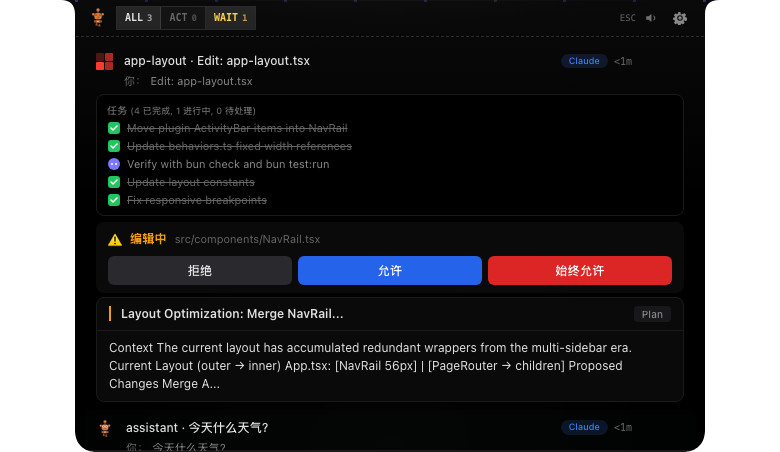
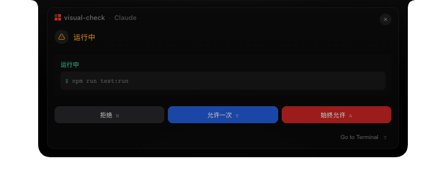
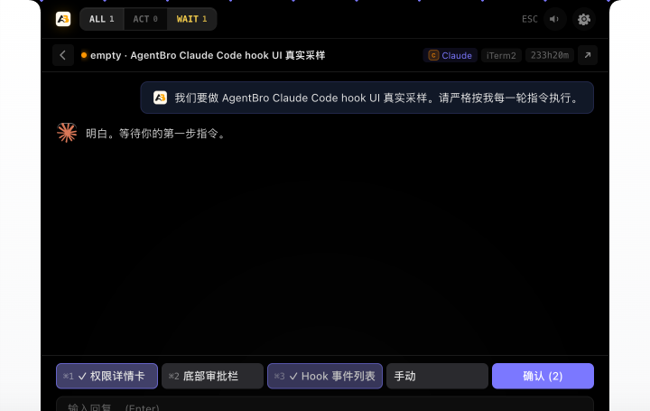

<div align="center">
  

  <h1>AgentBro</h1>

  <p><strong>让 Agent 更好用</strong></p>

  <p>
    面向 AI 编程 Agent 的 macOS 灵动岛。<br />
    把权限请求、问题、计划、工具调用、快速回复、远程会话和完成提醒，收进一个轻巧的桌面浮窗。
  </p>

  <p>
    <a href="https://www.agentbro.net">官网</a>
    ·
    <a href="https://github.com/shirenchuang/agentbro/releases">下载</a>
    ·
    <a href="README.en.md">English</a>
  </p>

  <p>
    
    
    
  </p>
</div>

## AgentBro 是什么？

AgentBro 是一个悬浮在编辑器和终端上方的原生 macOS 应用。它会实时观察 Claude Code、Codex、Gemini CLI 等 AI 编程 Agent 的会话状态，把最容易打断心流的事情集中到一个灵动岛里处理。你可以直接在弹窗里批准权限、回答问题、回复消息，也可以把 SSH 远程机器上的 Agent 会话转发回本机查看。

第一个开源版本聚焦在 **灵动岛模块**。Agent Monitor、Agent Switch、Skills 管理等更大的模块暂时不会出现在公开版菜单里，后续会结合实际使用和社区反馈逐步开放。

## Logo 含义

AgentBro 的 Logo 中间是一个握手造型，代表人和 AI Agent 之间的协作关系：不是替代，也不是遥控，而是像 bro 一样在旁边接力、提醒、兜底。外层的 `A` / `B` 结构来自 AgentBro 的首字母，也像两个 Agent 节点连接在一起。

## 截图



| 权限卡片 | 详情模式 |
| --- | --- |
|  |  |

## 主要功能

| 功能 | 说明 |
| --- | --- |
| 灵动岛浮窗 | 支持紧凑、悬停、展开和详情视图，随时查看 Agent 状态。 |
| 即时处理 | 在浮窗中处理权限请求、问题、计划审批、完成提醒和回复卡片。 |
| 快速回复 | 不切回终端，也可以直接在弹窗里输入消息，继续和 Agent 对话。 |
| 任务感知 | 展示工具调用、Subagent 活动、任务摘要，以及支持场景下的 Token / Rate Limit 信息。 |
| Hook 集成 | 一键安装 Hook，内置 Hook Doctor 诊断，支持自定义 CLI Hook 模板。 |
| 桌面体验 | 支持全局快捷键、声音、通知、主题、显示器位置和终端焦点智能降噪。 |
| 本地优先 | Hook Server 默认运行在本机，支持 `/tmp/agentbro.sock` 或 `127.0.0.1:17892`。 |
| SSH Remote | 支持把远程 SSH 机器上的 Agent 事件转发回本机灵动岛，适合远程开发场景。 |
| Webhook 通知 | 支持钉钉 / 飞书 Webhook 通知。 |

## 支持的 Agent

AgentBro 内置了以下 Agent 的适配器和 Hook 管理能力：

- Claude Code
- Codex
- Gemini CLI
- Cursor / Cursor CLI
- GitHub Copilot
- Trae / Trae CN
- Qoder / Qoder CLI
- CodeBuddy / CodeBuddy CN
- Qwen、Kimi、OpenCode、Droid、Factory、StepFun、AntiGravity、WorkBuddy、Hermes、Pi、Kiro

## 路线图

AgentBro 会坚持本地优先：第一个公开版本先把灵动岛、Hook 集成、快速处理和 SSH Remote 做扎实。后续希望继续探索：

- 远程同步：跨设备同步设置、Hook、主题、Prompt、Skills 和远程主机配置。
- 技能社区：发现、安装、分享和更新面向不同 Agent 的 Skill Pack。
- 团队协作：共享配置、团队 Skill 包、权限控制和更清晰的协作视图。

## 加入交流群

如果你正在使用 AgentBro，或者想参与后续 Windows、Agent Monitor、Agent Switch、Skills 等模块讨论，可以扫码添加微信，备注 **AgentBro 交流群**。

<div align="center">
  
</div>

## 平台支持

AgentBro 当前优先开发、测试和发布 **macOS** 版本。

Windows 支持在计划中。Tauri + React + Rust 的基础架构具备跨平台能力，但一个体验良好的 Windows 版本还需要单独适配悬浮窗口、托盘、快捷键、终端/编辑器焦点检测、Hook 路径、安装包、签名和发布流程。

Linux 后续也可以支持，但不属于第一个公开版本的目标。

## 本地开发

### 环境要求

- macOS
- Node.js
- pnpm
- Rust toolchain + Cargo
- Tauri CLI：`cargo tauri --version`

### 启动项目

```bash
git clone https://github.com/shirenchuang/agentbro.git
cd agentbro
pnpm install
pnpm tauri:dev
```

`pnpm tauri:dev` 会启动 `http://localhost:1423` 上的 Vite 开发服务，并打开 AgentBro 原生窗口。

### 只调试浏览器 UI

```bash
pnpm dev
```

打开：

- 灵动岛 UI：`http://localhost:1423`
- 设置面板：`http://localhost:1423/#settings`

浏览器开发模式内置了 Claude Hook UI Lab，可以切换权限请求、计划审批、问题、完成提醒、紧凑模式、列表模式和详情模式等静态场景。

### 常用命令

```bash
pnpm test:run      # 运行测试
pnpm test          # 监听模式运行测试
pnpm lint          # ESLint
pnpm build         # 类型检查并构建前端
cargo check        # 检查 Rust 后端
pnpm tauri:build   # 构建 Tauri 应用
./build.sh         # 构建通用 macOS DMG
```

## 接入 Agent

1. 打开 AgentBro 设置。
2. 进入 **Island -> Integration**。
3. 运行 **Hook Doctor**。
4. 点击 **Install All Hooks**，或只安装你正在使用的 Agent Hook。
5. 重启对应的 CLI 会话。
6. 启动 Claude Code、Codex、Gemini CLI 或其他支持的 Agent。

之后 AgentBro 会在灵动岛中展示会话状态、工具调用、权限请求、问题、计划和完成提醒。

## 发布

发布说明和签名要求见 [`docs/release.md`](docs/release.md)。

- 官网：[www.agentbro.net](https://www.agentbro.net)
- GitHub Releases：`https://github.com/shirenchuang/agentbro/releases`

## 开源协议

AgentBro 代码基于 [Apache License 2.0](LICENSE) 开源。

AgentBro 名称、Logo、应用图标、官网视觉和其他品牌资产不随代码授权开放。修改版或分发版请使用不同名称，避免和官方项目产生混淆，并遵守 [NOTICE](NOTICE) 和 [TRADEMARKS.md](TRADEMARKS.md)。
